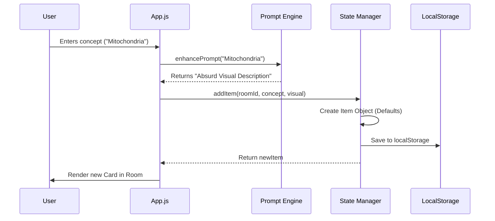
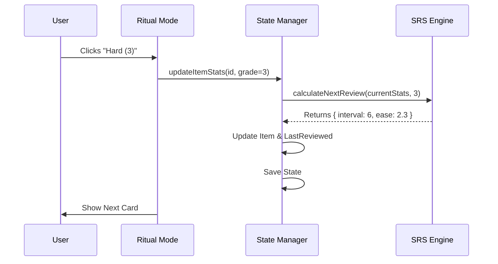

# System Architecture

## Overview

dome-icile is a vanilla JavaScript Single Page Application (SPA) designed to be lightweight, modular, and persistent. It intentionally avoids heavy frontend frameworks (React, Vue) to maintain a "close to the metal" understanding of the DOM and state management.

The system is built on an **Event-Driven, State-First** architecture.

## High-Level Diagram

```mermaid
graph TD;
    User[User Interaction] --> DOM[DOM Elements];
    DOM --> App[src/app.js];

    subgraph "Core Engines"
        App --> StateM[State Manager];
        App --> SettingsM[Settings Manager];
        App --> AudioE[Audio Engine];
        App --> PromptE[Prompt Engine (Foundry)];
    end

    subgraph "Logic Modules"
        StateM --> SRS[SRS Engine];
        App --> GateK[Gatekeeper (Quiz)];
        App --> Ritual[Ritual Mode];
    end

    subgraph "Persistence"
        StateM --> LS[(LocalStorage)];
        SettingsM --> LS;
    end

    subgraph "External APIs"
        PromptE --> Gemini[Google Gemini API];
        AudioE --> OpenAI[OpenAI API (Optional)];
    end
```

## Core Components

### 1. State Manager (`src/state_manager.js`)
*   **Role:** Single Source of Truth for domain data (Rooms, Items, Stats).
*   **Persistence:** Auto-syncs to `localStorage` on every modification.
*   **Data Model:**
    ```json
    {
      "rooms": {
        "foyer": {
          "id": "foyer",
          "items": [ ... ]
        }
      }
    }
    ```

### 2. Settings Manager (`src/settings_manager.js`)
*   **Role:** Manages user preferences (Audio, Visuals, API Keys).
*   **Reactivity:** Updates CSS variables and DOM dataset attributes in real-time when settings change (e.g., toggling "Decay" effects).

### 3. App Controller (`src/app.js`)
*   **Role:** The "Glue". Handles:
    *   Initial render.
    *   Event delegation (clicks, form submissions).
    *   Orchestrating interactions between engines (e.g., User clicks "Save" -> Prompt Engine generates text -> State Manager saves item -> DOM updates).

### 4. SRS Engine (`src/srs_engine.js`)
*   **Role:** Pure functional logic for the Spaced Repetition System.
*   **Algorithm:** Modified SuperMemo-2 (SM-2).
*   **Input:** Current Stats + User Grade.
*   **Output:** Next Interval, Repetition Count, Ease Factor.

## Data Flow: creating an Item



## Data Flow: Reviewing an Item (Ritual Mode)


